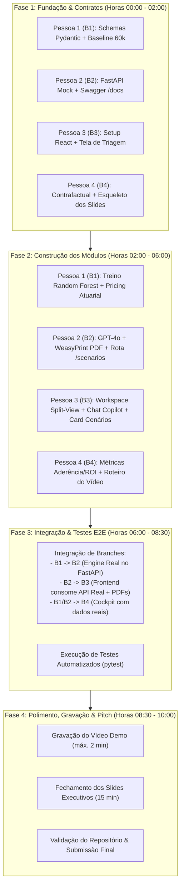

# ROADMAP.md — Cronograma de Execução e Integração (Spec-Driven Development)

**Projeto:** EnterOS — Política Inteligente de Acordos e Governança Jurídica (Banco Unicamp)  
**Metodologia:** Spec-Driven Development (SDD) com 4 branches paralelas e isoladas  
**Stack Principal:** Python 3.10+, FastAPI, Random Forest / Jurimetria Scikit-Learn, OpenAI GPT-4o, WeasyPrint, React 19 + Vite, SQLite / Pandas / PyArrow.

---

## 1. Visão Geral do Fluxo de Trabalho (Workflow & Checkpoints)



---

## 2. Detalhamento das 4 Branches de Trabalho

```
suits_ai/
├── src/policy/          👉 [PESSOA 1 EXCLUSIVO] Engine, Random Forest, Pricing, Schemas
├── scripts/             👉 [PESSOA 1 EXCLUSIVO] Pipeline de Dados e Treinamento
├── artefatos/           👉 [PESSOA 1 EXCLUSIVO] Modelos serializados .pkl e metadados
├── backend/             👉 [PESSOA 2 EXCLUSIVO] FastAPI, Routers, Agentes GPT-4o, WeasyPrint, SQLite
├── frontend/            👉 [PESSOA 3 EXCLUSIVO] React 19 + Vite, Workspace, Split-View, Chat UI
├── src/monitor/         👉 [PESSOA 4 EXCLUSIVO] Métricas A01-A20, E01-E20, Contrafactual
├── docs/                👉 [PESSOA 4 EXCLUSIVO] Slides de Apresentação, Roteiro do Vídeo
└── tests/               👉 [COMPARTILHADO] Testes unitários e de integração
```

---

## 3. Cronograma Passo a Passo (Fase a Fase)

### 🚀 FASE 1: Fundação, Schemas e Mocks
*Meta: Garantir que todos comecem imediatamente sem depender do código final uns dos outros.*

* **🌿 Pessoa 1 (`feature/policy-engine-ml`):**
  - [ ] Criar `src/policy/schemas.py` com os modelos Pydantic (`PolicyResult`, `SettlementPricing`).
  - [ ] Criar `scripts/01_prepare_data.py` e validar a leitura das 60.000 sentenças de `artefacts/Hackaton Unicamp/Hackaton_Enter_Base_Candidatos.xlsx`.
  - [ ] Estabelecer o cálculo do baseline de custos históricos do Banco Unicamp.
* **🌿 Pessoa 2 (`feature/backend-api-copilot`):**
  - [ ] Inicializar o servidor FastAPI em `backend/main.py` com suporte a CORS e Uvicorn.
  - [ ] Criar rotas mockadas com contratos definidos no `SPEC.md` (`GET /api/cases`, `GET /api/cases/{id}`, `POST /api/analyze`).
  - [ ] Validar documentação interativa em `http://localhost:8000/docs` para a Pessoa 3 consumir.
* **🌿 Pessoa 3 (`feature/frontend-lawyer-platform`):**
  - [ ] Configurar React 19 + Vite com Tailwind/CSS e roteamento em `frontend/`.
  - [ ] Construir a tela de **Triagem de Casos** consumindo a lista mockada da API do backend.
  - [ ] Criar o esqueleto do layout da página de **Workspace do Processo**.
* **🌿 Pessoa 4 (`feature/governance-monitoring-dashboard`):**
  - [ ] Estruturar o dataset enriquecido com advogados e escritórios parceiros sintéticos.
  - [ ] Montar o cálculo básico de simulação contrafactual de economia financeira.
  - [ ] Criar o esqueleto da apresentação de slides em `docs/presentation.md` (ou Figma/Deck).

---

### ⚙️ FASE 2: Construção dos Módulos e Lógicas Reais
*Meta: Desenvolver os cérebros de cada frente de forma desacoplada.*

* **🌿 Pessoa 1 (`feature/policy-engine-ml`):**
  - [ ] `scripts/02_train_model.py`: Treinar o **Random Forest jurimétrico calibrado** e exportar `artefatos/modelo_jurimetrico.pkl`.
  - [ ] `src/policy/engine.py`: Implementar a matriz híbrida (Dossiê NÃO CONFORME $\rightarrow$ Acordo Fast-Track, 3 críticos $\rightarrow$ Defesa, 0-1 crítico $\rightarrow$ Acordo, 2 críticos $\rightarrow$ Random Forest).
  - [ ] `src/policy/pricing.py`: Implementar o cálculo atuarial de $\mathbb{E}[\text{Perda}]$ e régua de alçada (Piso, Alvo, Teto).
  - [ ] Escrever testes unitários em `tests/test_policy.py` e `tests/test_pricing.py`.
* **🌿 Pessoa 2 (`feature/backend-api-copilot`):**
  - [ ] `backend/services/document_service.py`: Leitura e extração de dados dos casos reais (Casos 01 e 02 dos arquivos ZIP).
  - [ ] `POST /api/scenarios`: Endpoint de War Room judicial (Teses do Atacante/Autor vs. Tendências do Juiz da comarca).
  - [ ] `POST /api/chat`: Chat Copilot interativo com GPT-4o contextualizado no caso.
  - [ ] `POST /api/generate-draft` & `POST /api/export-pdf`: Gerador de minutas de Contestação e Termo de Acordo em PDF timbrado via **WeasyPrint**.
  - [ ] `backend/database/`: Persistência SQLite para salvar decisões e feedbacks/overrides dos advogados.
* **🌿 Pessoa 3 (`feature/frontend-lawyer-platform`):**
  - [ ] Concluir o **Workspace Split-View** (Autos da Ação à esquerda e Subsídios do Banco à direita).
  - [ ] Implementar o card de **Simulação de Cenários Judiciais** (War Room).
  - [ ] Implementar o painel lateral do **Chat Jurídico Copilot** com *quick prompts*.
  - [ ] Implementar o módulo de **Minutas & Negociação** (Visualizador/Editor da minuta + Botão de Download PDF + Simulador Interativo de Alçada de Acordo).
  - [ ] Implementar o modal de **Conclusão de Caso** com registro de desfecho e justificativa de override.
* **🌿 Pessoa 4 (`feature/governance-monitoring-dashboard`):**
  - [ ] `src/monitor/metrics_adherence.py`: Implementar métricas de Aderência (A01–A20: taxa de seguimento, overrides por escritório/advogado).
  - [ ] `src/monitor/metrics_effectiveness.py`: Implementar métricas de Efetividade (E01–E20: economia real, sensibilidade de aceite).
  - [ ] Construir o **Cockpit de Monitoramento do Banco Unicamp** com filtros dinâmicos por UF, Escritório e Slider de Aceite.
  - [ ] Redigir o roteiro do vídeo demo de 2 minutos (`docs/video_script.md`).

---

### 🔗 FASE 3: Integração, Merges e Testes de Ponta a Ponta
*Meta: Unificar todas as branches na branch principal (`main`) e validar o fluxo completo.*

1. **Checkpoint de Merge 1 (B1 $\rightarrow$ B2):**
   - A Pessoa 2 integra a Engine e o modelo Random Forest da Pessoa 1 no backend FastAPI (`/api/analyze`).
2. **Checkpoint de Merge 2 (B2 $\rightarrow$ B3):**
   - A Pessoa 3 conecta o frontend React aos endpoints reais de IA, cenários, chat e geração de PDF via WeasyPrint.
3. **Checkpoint de Merge 3 (B1/B2 $\rightarrow$ B4):**
   - A Pessoa 4 valida o Cockpit de Monitoramento consumindo as decisões e projeções financeiras consolidadas.
4. **Validação E2E:**
   - Executar a suíte de testes automatizados (`pytest tests/`).
   - Validar a execução via comando único (`python run.py`).

---

### 🏆 FASE 4: Vídeo Demo, Apresentação Executiva e Submissão
*Meta: Entregar os materiais de altíssimo impacto para a banca avaliadora.*

* **Vídeo Demo (máx. 2 minutos):**
  - [ ] Gravar a navegação fluida do advogado: Triagem $\rightarrow$ Split-View dos Autos $\rightarrow$ Recomendação Explicada $\rightarrow$ War Room/Chat $\rightarrow$ Geração da Minuta em PDF em 1 clique $\rightarrow$ Registro de Acordo/Defesa.
  - [ ] Gravar a visão executiva do Banco no Cockpit de Governança (ROI e Economia Anual de R$ 55M a R$ 68M).
* **Apresentação Final (15 minutos / Slides):**
  - [ ] **Slide 1-3:** Contexto do problema, dor dos ~5k casos/mês e gargalo dos subsídios.
  - [ ] **Slide 4-6:** A política de acordos e o modelo Random Forest antifraude (explicado em linguagem jurídica simples).
  - [ ] **Slide 7-9:** Potencial financeiro da iniciativa (*Cost Avoidance* e ROI detalhado).
  - [ ] **Slide 10-12:** A experiência do advogado (EnterOS UX, gerador de minutas e copiloto de negociação).
  - [ ] **Slide 13-14:** Arquitetura técnica autoral e governança de conformidade.
  - [ ] **Slide 15:** Limitações conhecidas e próximos passos para 1 mês adicional de roadmap.
* **Submissão:**
  - [ ] Repositório limpo, documentado com `README.md`, `SETUP.md`, `SOLUTION.md`, `SPEC.md` e `ROADMAP.md`.
  - [ ] Link do vídeo e slides anexados.

---

## 4. Matriz de Entregáveis e Critérios de Aceite

| # | Entregável | Critério de Aceite | Responsável Principal |
|---|---|---|---|
| 1 | **Motor de Decisão & Random Forest** | Decisão auditável para 100% dos casos; Dossiê não conforme priorizado; AUC e calibração validadas; pricing atuarial funcional. | Pessoa 1 |
| 2 | **FastAPI Backend + Agentes IA** | Endpoints REST assíncronos documentados no Swagger; integração GPT-4o e WeasyPrint gerando PDFs timbrados. | Pessoa 2 |
| 3 | **Plataforma React do Advogado** | Interface fluida; split-view funcional; chat copiloto interativo; download de minutas de Contestação e Acordo em 1 clique. | Pessoa 3 |
| 4 | **Cockpit de Governança & ROI** | Métricas de aderência e efetividade calculadas; demonstrativo claro de economia milionária (*Cost Avoidance*). | Pessoa 4 |
| 5 | **Vídeo Demo (2 min) & Slides** | Vídeo objetivo focado na UX do advogado; apresentação executiva cobrindo todos os requisitos do edital do hackathon. | Equipe Toda / Pessoa 4 |
