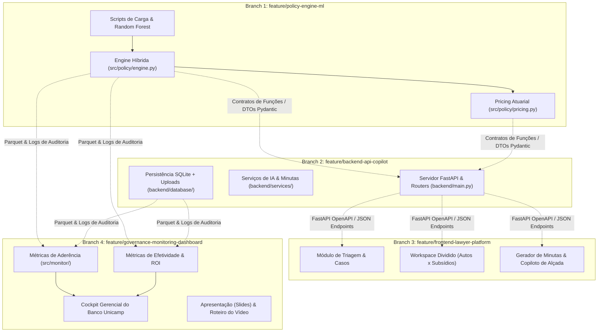

# SPEC.md — Especificação Técnica e Divisão de Responsabilidades (Spec-Driven Development)

**Projeto:** EnterOS — Política Inteligente de Acordos e Governança Jurídica (Banco Unicamp)  
**Abordagem:** Construção 100% autoral e modular via Spec-Driven Development (SDD)  
**Divisão da Equipe:** 4 integrantes trabalhando em branches paralelas e desacopladas  
**Stack Principal:** Python 3.10+, **FastAPI** (com validação Pydantic e OpenAPI automático), **Random Forest / Jurimetria Calibrada**, OpenAI API (GPT-4o), React 19 + Vite, SQLite / Pandas / PyArrow.

---

## 1. Arquitetura do Sistema e Contratos de Integração

A aplicação é dividida em 4 módulos independentes, com contratos de dados e interfaces padronizados para garantir desenvolvimento paralelo sem bloqueios:



---

## 2. Divisão por Branches e Atribuições (4 Integrantes)

---

### 🌿 Branch 1: `feature/policy-engine-ml`
**Responsável:** Integrante 1 (Data Science & Jurimetrics Lead)  
**Objetivo:** Construir o pipeline de dados, o classificador jurimétrico em **Random Forest** (calibrado) e o motor de regras e precificação atuarial.

#### Entregáveis da Branch 1:
1. **Pipeline de Dados & Treinamento:**
   - Ingestão e limpeza da base oficial de 60.000 sentenças (`scripts/01_prepare_data.py`).
   - Treinamento do modelo supervisionado **Random Forest** (`scripts/02_train_model.py`) com validação cruzada e calibração de probabilidade de perda em zonas cinzentas.
   - Serialização dos artefatos em `artefatos/modelo_jurimetrico.pkl` e `artefatos/features.json`.
2. **Motor de Decisão Híbrido (`src/policy/engine.py`):**
   - Regra 1: Dossiê NÃO CONFORME $\rightarrow$ `ACORDO FAST-TRACK`.
   - Regra 2: Três subsídios críticos (Contrato + TED + BACEN) $\rightarrow$ `DEFESA`.
   - Regra 3: Falha probatória grave (0 a 1 crítico) $\rightarrow$ `ACORDO`.
   - Regra 4: Zona cinzenta (2 críticos) $\rightarrow$ Classificação via modelo Random Forest jurimétrico.
3. **Motor de Precificação Atuarial (`src/policy/pricing.py`):**
   - Cálculo do Custo Esperado de Perda $\mathbb{E}[\text{Perda}]$.
   - Determinação da régua de alçada: **Piso de Abertura**, **Valor Alvo** e **Teto de Alçada**.
4. **Suíte de Testes Unitários:**
   - Testes em `tests/test_policy.py` e `tests/test_pricing.py` cobrindo todos os fluxos da árvore de decisão.

#### Contrato de Interface (Pydantic DTOs - Export da Branch 1):
```python
# src/policy/schemas.py
from pydantic import BaseModel
from typing import Dict, List, Optional

class SettlementPricing(BaseModel):
    floor: float
    target: float
    ceiling: float
    expected_loss: float

class PolicyResult(BaseModel):
    recommendation: str          # "DEFESA" | "ACORDO"
    reasoning_code: str          # "DOSSIE_NAO_CONFORME" | "CADEIA_COMPLETA" | "FALHA_PROBATORIA" | "ML_ZONA_CINZENTA"
    confidence_score: float      # 0.0 a 1.0
    risk_level: str              # "BAIXO" | "MEDIO" | "ALTO" | "CRITICO"
    settlement_pricing: Optional[SettlementPricing] = None
    applied_rules: List[str]

def evaluate_case(case_data: dict) -> PolicyResult:
    """Função pura que recebe o dicionário do caso e retorna a decisão estruturada."""
    ...
```

---

### 🌿 Branch 2: `feature/backend-api-copilot`
**Responsável:** Integrante 2 (Backend & AI Copilot Lead)  
**Objetivo:** Construir a API **FastAPI** assíncrona, esteira de agentes OpenAI (GPT-4o), extração semântica de documentos, geração de minutas e persistência relacional.

#### Entregáveis da Branch 2:
1. **API RESTful FastAPI (`backend/`):**
   - `GET /api/cases` — Listagem paginada de processos com status e filtros.
   - `GET /api/cases/{case_id}` — Detalhamento completo dos autos e subsídios do caso.
   - `POST /api/analyze` — Parecer explicativo gerado por IA conectando a `Policy Engine` à análise dos autos.
   - `POST /api/scenarios` — Simulação de cenários judiciais (previsão das teses do atacante/autor e tendências de julgamento do juiz da comarca).
   - `POST /api/chat` — Chat interativo em tempo real (Copilot) contextualizado com os autos, subsídios, teses adversariais e histórico do caso.
   - `POST /api/generate-draft` — Geração instantânea da **Minuta de Contestação** ou **Minuta de Termo de Acordo / WhatsApp**.
   - `POST /api/export-pdf` — Compilação da minuta em **PDF timbrado oficial do Banco Unicamp via WeasyPrint** (estilização CSS Forense / Paged Media).
   - `POST /api/negotiation-copilot` — Assistente de negociação que valida contrapropostas do autor em tempo real.
   - `POST /api/decisions` — Registro formal da decisão do advogado (desfecho, valores e motivos de eventual override).
   - Documentação OpenAPI / Swagger interativa nativa em `/docs`.
2. **Serviço de Processamento de Documentos (`backend/services/document_service.py`):**
   - Extração estruturada de dados dos autos (petição inicial, procuração) e subsídios (contrato, extrato, BACEN, dossiê).
   - Validação de consistência cadastral (match de CPF, titularidade e valores).
3. **Persistência Relacional (`backend/database/`):**
   - Banco de dados SQLite assíncrono para registro permanente de novos casos, decisões tomadas e histórico de interações.

#### Contrato de Interface (FastAPI Router DTOs):
```python
# backend/schemas.py
from pydantic import BaseModel
from typing import List, Optional

class DraftRequest(BaseModel):
    case_id: int
    action: str  # "DEFESA" | "ACORDO"
    settlement_amount: Optional[float] = None

class DraftResponse(BaseModel):
    status: str
    document_type: str
    title: str
    content_markdown: str
    attached_subsidies: List[str]
```

---

### 🌿 Branch 3: `feature/frontend-lawyer-platform`
**Responsável:** Integrante 3 (Frontend & UX Lead)  
**Objetivo:** Construir do zero a interface React 19 + Vite com visualização em split-view, card de cenários adversariais, chat copiloto, gerador de minutas e assistente de contrapropostas.

#### Entregáveis da Branch 3:
1. **Autenticação & Seleção de Perfil (`frontend/src/pages/Login/`):**
   - Tela de login com alternância rápida em 1 clique entre **"Dr. Lucas Ramos (Advogado - Pinheiro & Associados)"** e **"Dra. Mariana Souza (Diretoria Jurídica - Banco Unicamp)"**.
   - Header global com seletor de perfil e badge de identificação do usuário ativo.
2. **Triagem de Processos (`frontend/src/pages/CaseSelection/`):**
   - Tabela moderna com tags visuais de recomendação (🟢 Defesa, 🟡 Acordo, 🔴 Acordo Fast-Track), filtro por status probatório e valor da causa.
3. **Workspace Analítico (`frontend/src/pages/Workspace/`):**
   - **Visualizador Dividido (Split-View):** Autos da Ação à esquerda e Subsídios do Banco à direita.
   - **Card de Inteligência EnterOS:** Parecer sumarizado, probabilidade calibrada $P(\text{derrota})$ e comparativo financeiro ($\mathbb{E}[\text{Perda}]$ vs. Alvo do Acordo).
   - **Card de Simulação de Cenários Judiciais (War Room):** Abas com ⚔️ *Teses do Atacante* | 👨‍⚖️ *Tendência do Juiz* | 🛡️ *Neutralização*.
   - **Chat Jurídico Copilot (Painel Lateral/Flutuante):** Interface de conversação em tempo real para tirar dúvidas sobre o caso com *quick prompts* pré-configurados.
4. **Copiloto de Minutas e Negociação (`frontend/src/components/DraftCopilot/`):**
   - Botão de geração de minutas com visualizador/editor e download em 1 clique via WeasyPrint.
   - **Simulador Interativo de Alçada:** Barra dinâmica (Piso $\rightarrow$ Alvo $\rightarrow$ Teto) que avalia em tempo real a contraproposta do autor.
5. **Modal de Fechamento de Caso (`frontend/src/components/CaseConclusion/`):**
   - Registro intuitivo do resultado (defesa protocolada, acordo fechado ou justificativa de override).

---

### 🌿 Branch 4: `feature/governance-monitoring-dashboard`
**Responsável:** Integrante 4 (Governance, Data Analytics & Pitch Lead)  
**Objetivo:** Construir os módulos de governança (Aderência e Efetividade), relatórios operacionais do banco e produzir os materiais de apresentação e vídeo.

#### Entregáveis da Branch 4:
1. **Motor de Métricas Analíticas (`src/monitor/`):**
   - **Aderência (A01–A20):** Taxa de seguimento global, taxa de override, aderência por escritório parceiro e drift temporal.
   - **Efetividade (E01–E20):** Economia total acumulada (*Cost Avoidance* em R$), taxa de conversão e sensibilidade da negociação.
   - **Diagnóstico da Esteira de Subsídios:** Identificação de causas-raiz de subsídios faltantes nos sistemas do próprio banco.
2. **Cockpit Gerencial do Banco Unicamp (`frontend/src/pages/Monitoring/`):**
   - Dashboard analítico integrado com filtros dinâmicos por UF, Escritório, Período e controle de sensibilidade.
3. **Artefatos de Apresentação e Submissão:**
   - `docs/presentation.pdf` (ou link de slides): Apresentação executiva de 15 minutos cobrindo política, finanças, UX e arquitetura.
   - `docs/video_script.md` e gravação do vídeo pitch de 2 minutos.

---

## 3. Matriz de Integração e Etapas de Desenvolvimento

| Fase | Foco da Fase | O que cada Branch entrega |
| :--- | :--- | :--- |
| **Fase 1: Fundação** | Contratos Pydantic e Estrutura Inicial | • **B1:** `schemas.py` + baseline dos dados 60k.<br>• **B2:** Servidor FastAPI base + rotas com Swagger em `/docs`.<br>• **B3:** Layout inicial do Workspace.<br>• **B4:** Script de cálculo do contrafactual. |
| **Fase 2: Construção** | Implementação dos Módulos Principais | • **B1:** Random Forest treinado + Pricing atuarial.<br>• **B2:** Agente de minutas GPT-4o + Endpoints FastAPI.<br>• **B3:** Split viewer + Copiloto de negociação.<br>• **B4:** Cockpit de Aderência e Efetividade. |
| **Fase 3: Integração** | Merges e Testes de Ponta a Ponta | • Merge de B1 e B2 $\rightarrow$ FastAPI com motor jurimétrico completo.<br>• Conexão de B3 com B2 $\rightarrow$ Frontend operacional.<br>• Conexão de B4 com a base de dados real $\rightarrow$ Métricas validadas. |
| **Fase 4: Finalização** | Testes Finais, Gravação do Vídeo e Slides | • Execução de testes automatizados (`pytest`).<br>• Gravação do vídeo demo de 2 minutos.<br>• Fechamento dos slides da apresentação final (15 min). |

---

## 4. Orquestrador de Execução (`run.py`)

A raiz do projeto terá o script unificado `run.py` com Uvicorn para subir toda a aplicação em um único comando:

```bash
# Inicialização completa da solução:
python run.py
```

* **Frontend & Plataforma do Advogado:** `http://localhost:8000/`
* **Cockpit de Monitoramento do Banco:** `http://localhost:8000/monitoramento`
* **Swagger API Docs (FastAPI):** `http://localhost:8000/docs`
