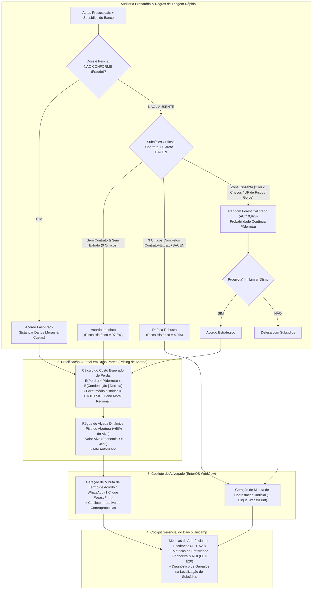

# SOLUTION.md — Arquitetura Autoral da Política Inteligente de Acordos e Governança Jurídica (EnterOS / Banco Unicamp)

**Projeto:** Enter Hackathon Unicamp — EnterOS  
**Escopo:** Política de Acordos, Jurimetria Preditiva, Copiloto do Advogado e Cockpit de Governança para o Banco Unicamp  
**Desenvolvimento:** Solução 100% original e desenvolvida do zero  
**Stack Principal:** Python 3.10+, **FastAPI** (com validação Pydantic), **Random Forest / Jurimetria Calibrada**, OpenAI API (GPT-4o), React 19 + Vite, SQLite / Pandas / PyArrow.

---

## 1. Contexto e Desafio de Negócio

O **Banco Unicamp** enfrenta um volume de **~15.000 novos processos judiciais cíveis por mês**, dos quais cerca de **~5.000 casos** tratam de **não reconhecimento de contratação de empréstimo** (o consumidor alega descontos indevidos referentes a contratos que afirma não ter firmado).

A auditoria e jurimetria empírica sobre a base histórica de **60.000 processos** revelou os seguintes fatos estruturantes:
- **Taxa Histórica de Acordos:** Apenas **0,47%** (280 acordos em 60 mil processos).
- **Desembolso em Condenações:** **R$ 192,98 milhões** pagos (taxa de condenação de **30,1%** entre os casos sem acordo, com ticket médio de **R$ 10.658,35**).
- **O Fator Crítico (Power Pair):** A ausência conjunta de **Contrato e Extrato** eleva a taxa de condenação para **97,3%**, enquanto a presença de ambos reduz para **6,9%**.
- **Concentração de Risco:** 36,0% dos casos (onde falta pelo menos Contrato ou Extrato) concentram **85,3% de todas as condenações e desembolsos financeiros**.

Nossa solução foi projetada do zero como uma plataforma nativa para o ecossistema **EnterOS**, unindo auditoria probatória automatizada, jurimetria preditiva com **Random Forest calibrado**, precificação atuarial em duas partes, geração de peças e governança contínua de aderência e efetividade.

---

## 2. Princípios de Design e Inovações Próprias

Nossa arquitetura foi desenhada a partir dos seguintes pilares autorais:

---

## 3. Por que ainda precisamos do Random Forest (AUC 0,923)?

Embora as regras determinísticas resolvam os casos extremos (0 subsídios $\rightarrow$ Acordo com 97,3% de risco; 3 subsídios $\rightarrow$ Defesa com 4% de risco), o **Random Forest** é indispensável por dois motivos técnicos e negociais cruciais:

1. **Desempate na Zona Cinzenta (36% da carteira):**
   - Casos com apenas Extrato (risco de 61,4%) ou apenas Contrato (risco de 59,5%) sofrem grande variação conforme a **UF** (de 20,5% no MA a 48,0% no AP/AM) e o **Subassunto** (casos de *Golpe* têm 36,0% de risco vs 16,8% em *Genérico*).
   - O Random Forest pondera simultaneamente: `[Contrato, Extrato, BACEN, Dossiê, Demonstrativo, Laudo, UF, Subassunto, Log(Valor Causa)]`, atingindo **AUC de 0,923** e **Brier score de 0,092**.
2. **Alimentação Contínua do Motor Atuarial de Pricing:**
   - O cálculo do valor da proposta de acordo exige uma probabilidade contínua e calibrada ($P(\text{derrota})$). Uma regra booleana estática não permite calcular com precisão se a alçada deve ser R$ 2.800 ou R$ 5.400. O Random Forest calibrado via `CalibratedClassifierCV` fornece essa estimativa atuarial precisa.
3. **Robustez e Explicabilidade:**
   - Não sofre de overfitting em dados tabulares jurídicos e permite extrair a importância das features (Contrato: -62,5pp, Extrato: -62,9pp, BACEN: -26,8pp), justificando o parecer de forma transparente para o advogado e o comitê de auditoria.

---

## 4. O Papel dos Subsídios e a Matriz de Decisão Jurídica

Os **Subsídios** são os documentos de defesa que os sistemas internos do Banco Unicamp conseguem localizar e disponibilizar para municiar o advogado:

1. **Contrato (Cédula de Crédito Bancário):** Prova formal de consentimento e termos da operação.
2. **Extrato Bancário (Comprovante de Depósito/TED):** Prova de que os recursos foram transferidos para a conta de titularidade do autor.
3. **Comprovante BACEN:** Registro regulatório formal da operação junto ao Banco Central.
4. **Dossiê Antifraude (Empresa Pericial Terceirizada):**
   - **CONFORME:** Atesta autenticidade da assinatura e biometria facial do autor.
   - **NÃO CONFORME:** Atesta que a assinatura/biometria é divergente (fraude ocorrida no passado).
5. **Demonstrativo de Evolução da Dívida:** Histórico de pagamentos mensais (comprova consentimento tácito e usufruto).
6. **Laudo Referenciado:** Síntese do canal de contratação (digital, agência, correspondente).

### Matriz de Decisão Estratégica

| Cenário | Conjunto Probatório | Decisão Recomendada | Fundamentação Jurídica & Econômica |
| :--- | :--- | :---: | :--- |
| **Fraude Confirmada** | Dossiê **NÃO CONFORME** | 🤝 **ACORDO FAST-TRACK** | A perícia interna atesta falsidade da assinatura. Contestar gerará condenação por dano moral majorado, perícia judicial cara e risco de multa por má-fé (Súmula 479/STJ). |
| **Força Probatória Plena** | **3 Críticos** (Contrato + TED + BACEN) + Dossiê Conforme | 🛡️ **DEFESA** | Cadeia probatória atende integralmente aos requisitos do CDC/CPC. Alta probabilidade de improcedência. |
| **Falha Probatória Severa** | **0 a 1 Crítico** localizado | 🤝 **ACORDO** | Com a inversão do ônus da prova (art. 6º, VIII, CDC), a falta de contrato e TED leva à condenação quase certa do banco. |
| **Usufruto Comprovado** | Extrato com histórico de uso do crédito e pagamentos de parcelas | 🛡️ **DEFESA** | Demonstra que o autor usufruiu do dinheiro antes de ajuizar a ação, afastando a alegação de desconhecimento. |
| **Zona Cinzenta** | **2 Críticos** (ex: TED + BACEN sem a imagem da CCB) | 🧠 **JURIMETRIA (RANDOM FOREST)** | Modelo Random Forest calibrado pondera a taxa de êxito da comarca e o risco financeiro do caso. |

---

## 5. Motor de Precificação Atuarial (Pricing Dinâmico)

Para superar abordagens ingênuas (como percentuais fixos sobre o valor da causa), nosso motor de precificação adota a métrica atuarial de **Custo Esperado de Perda ($\mathbb{E}[\text{Perda}]$)**:

$$\mathbb{E}[\text{Perda}] = P(\text{derrota}) \times \left( \text{Valor do Débito Declarado} + \text{Dano Moral Histórico da Vara/UF} + \text{Custas e Honorários} \right)$$

$$\text{Valor Alvo do Acordo} = \mathbb{E}[\text{Perda}] \times (1 - \text{Margem de Vantagem Financeira})$$

### Régua de Alçada de Negociação

* 🟢 **Piso de Abertura:** Proposta inicial econômica (~60% do valor alvo), garantindo margem para negociação.
* 🟡 **Valor Alvo:** Ponto ótimo de conversão que garante economia média $\ge 45\%$ em relação à condenação provável.
* 🔴 **Teto de Alçada:** Limite máximo que o advogado tem autorização para fechar antes de exigir aprovação da diretoria.

---

## 6. Experiência do Advogado (EnterOS Workflow)

Nossa plataforma entrega valor real do início ao fim do processo de trabalho do advogado:

1. **Triagem Rápida:** Listagem de casos priorizados por risco, valor e completude de subsídios.
2. **Workspace Analítico (Split-View):** Visualização lado a lado da Petição Inicial / Documentos do Autor e dos Subsídios do Banco.
3. **Simulação de Cenários Judiciais (War Room):**
   - ⚔️ **Teses do Atacante (Autor):** Mapeamento prévio dos contra-argumentos que a outra parte usará (alegação de conta de terceiro, súmula 479/STJ, coação de idoso).
   - 👨‍⚖️ **Tendência do Magistrado (Juiz):** Previsão do rigor probatório da comarca (se exige perícia presencial, histórico de inversão do CDC e faixa provável de dano moral).
   - 🛡️ **Estratégia de Neutralização:** Dicas para blindar a contestação ou justificar o acordo.
4. **Parecer Explicável & Chat Jurídico Copilot:**
   - Resumo jurídico automático fundamentando a estratégia recomendada.
   - **Chat Interativo em Tempo Real:** O advogado pode debater teses jurídicas, treinar contra-argumentos (*"Como rebater a tese da Súmula 479 se o autor alegar fraude?"*) e refinar minutas.
5. **Gerador de Minutas em 1 Clique (HTML/CSS via WeasyPrint):**
   - **Caso DEFESA:** Gera a minuta formal da **Contestação Judicial** em PDF timbrado, com fundamentação fática, citação expressa dos subsídios probatórios válidos anexados (CCB, TED, BACEN) e pedidos de improcedência.
   - **Caso ACORDO:** Gera a minuta do **Termo de Transação / Acordo Judicial** em PDF timbrado (com cláusulas de quitação plena, estorno e extinção pelo art. 487, III, 'b', CPC) + **Script padronizado de proposta para WhatsApp/E-mail**.
   - Ambas as minutas podem ser editadas diretamente na interface antes do download em PDF oficial ou exportação em Word/texto.
6. **Copiloto de Negociação:** Simulador em tempo real que avalia contrapropostas do autor contra a alçada do banco.

---

## 7. Governança e Monitoramento Gerencial (Banco Unicamp)

* **Monitoramento de Aderência:**
  - Taxa de seguimento global das recomendações pelos escritórios parceiros.
  - Auditoria de *overrides* (desvios) com motivos registrados e rankings de compliance.
* **Monitoramento de Efetividade & ROI:**
  - *Cost Avoidance* acumulado (economia líquida em R$ gerada pela política de acordos).
  - Taxa de conversão de acordos e análise de sensibilidade da negociação.
* **Diagnóstico da Esteira de Subsídios:**
  - Relatório de causas-raiz apontando em quais canais ou regiões o próprio banco enfrenta maior dificuldade de localização de contratos e documentos.

---

## 8. Impacto Financeiro Estimado

Com base no volume histórico de 60.000 sentenças e 5.000 novos casos/mês:
* **Gasto Histórico do Banco em Condenações:** ~R$ 190 milhões anuais.
* **Economia Anual Estimada (*Cost Avoidance*):** **R$ 55M a R$ 68M por ano** (redução de 30% a 35% no custo contencioso).
* **Eficiência Operacional:** Redução de mais de 60% no tempo de tramitação dos processos e alívio da sobrecarga dos escritórios parceiros.
