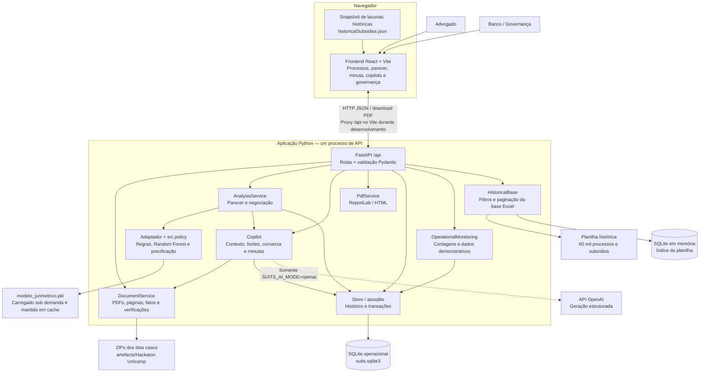
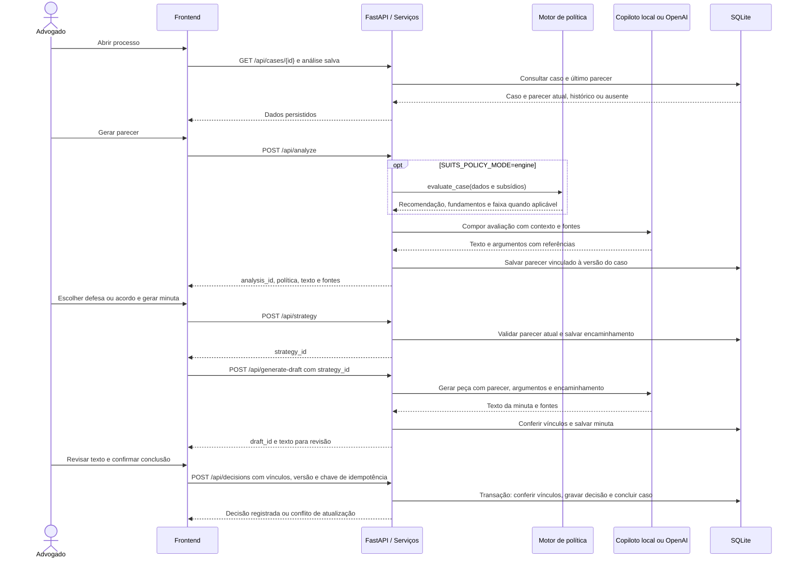
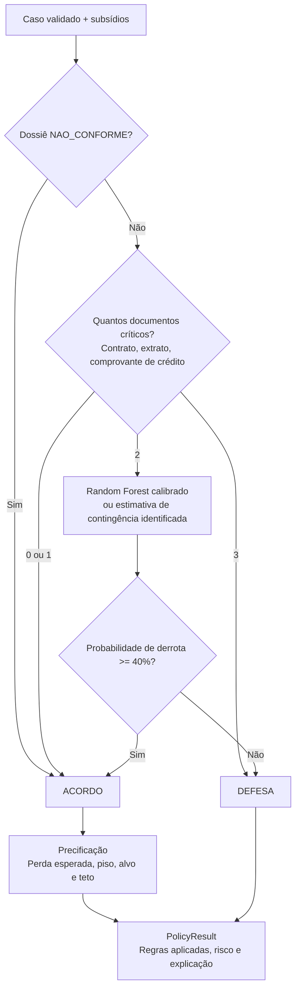
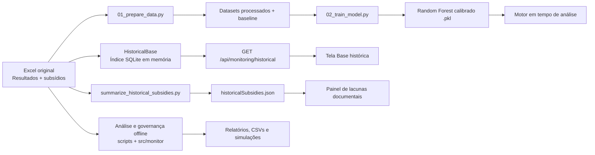

# Arquitetura da solução — Enter OS / Suits AI

Este documento descreve a implementação integrada do repositório: uma aplicação web com API modular, persistência local e processamento de dados offline. Os diagramas usam Mermaid e podem ser visualizados no GitHub ou em um renderizador Markdown compatível.

## Visão geral

O advogado consulta os documentos, obtém uma análise, define o encaminhamento, revisa a minuta e registra a conclusão. O banco consulta a base histórica e as telas de governança. A API centraliza a política, a geração de conteúdo e a persistência; o frontend apresenta os resultados e conduz as etapas da revisão.

As setas representam consultas, chamadas e dependências. Os serviços Python são módulos da mesma aplicação, sem comunicação por rede entre si. A única chamada externa de geração ocorre quando o modo OpenAI é habilitado. No modo `local`, o copiloto usa extração, busca de trechos e modelos de texto editáveis.

## Componentes e responsabilidades

| Componente | Responsabilidade | Código |
|---|---|---|
| Frontend | Navegação por perfil demonstrativo, triagem, parecer, edição da minuta, históricos e governança | [`src/frontend/src/`](../src/frontend/src/) |
| Inicialização da API | Carregar configurações, documentos iniciais, banco e serviços; registrar rotas e CORS | [`main.py`](../src/backend/main.py), [`config.py`](../src/backend/config.py) |
| Documentos | Ler PDFs dentro dos ZIPs, extrair texto por página e construir fatos e verificações com fonte | [`document_service.py`](../src/backend/services/document_service.py) |
| Análise e adaptação | Converter o caso para o contrato do motor, compor o parecer e comparar propostas com a faixa persistida | [`analysis_service.py`](../src/backend/services/analysis_service.py), [`policy_adapter.py`](../src/backend/services/policy_adapter.py) |
| Política | Aplicar regras, executar inferência na zona cinzenta, explicar a avaliação e precificar acordos | [`src/policy/`](../src/policy/) |
| Copiloto | Selecionar contexto do caso, gerar respostas e minutas e validar referências às fontes | [`copilot.py`](../src/backend/services/copilot.py) |
| Persistência | Salvar casos, pareceres, encaminhamentos, conversas, minutas, decisões e registros de governança demonstrativos | [`store.py`](../src/backend/database/store.py) |
| Exportação | Converter a minuta original ou o texto revisado em PDF/HTML | [`pdf_service.py`](../src/backend/services/pdf_service.py) |
| Monitoramento operacional | Consultar contagens e inventário; expor aderência demonstrativa por advogado | [`monitoring_service.py`](../src/backend/services/monitoring_service.py) |
| Base histórica | Validar as duas abas do Excel e consultar seu índice com busca, filtros, ordenação e paginação | [`historical_service.py`](../src/backend/services/historical_service.py) |
| Análise offline | Preparar dados, treinar modelo e produzir relatórios, métricas e simulações | [`scripts/`](../scripts/), [`src/monitor/`](../src/monitor/) |

## Fluxo operacional e persistência

A exportação usa `POST /api/export-pdf` e pode receber o conteúdo revisado. Ela não conclui o caso. Conversas e minutas podem ser recuperadas por listas paginadas; reabrir um processo consulta o parecer salvo sem gerar outro automaticamente.

Um parecer novo invalida o encaminhamento anterior para o fluxo de conclusão, mesmo sem mudar a versão do caso. Um encaminhamento novo exige outra minuta. O backend verifica os vínculos antes e depois da geração e na transação final. Documentos históricos permanecem consultáveis.

A conclusão usa `expected_case_version` e `idempotency_key`: repetir a mesma tentativa com o mesmo corpo recupera o registro existente; decisões concorrentes incompatíveis recebem HTTP 409. Divergências da recomendação ou valores acima do teto exigem `override_reason`. Sem política, a decisão não é marcada automaticamente como aderente. A API preserva contratos legados sem todos os vínculos; a interface integrada usa o fluxo vinculado descrito acima.

## Motor de política

O adaptador traduz os campos documentais para o schema do motor, preservando a distinção entre dossiê ausente e dossiê sem conclusão identificada. Conclusões conflitantes ou valor da causa inválido impedem a avaliação.

O modelo recebe indicadores de documentos, contagens de subsídios, valor da causa, transformação logarítmica e UF. É carregado na avaliação da zona cinzenta e reutilizado em memória. Falha no carregamento ou na predição ativa a contingência descrita na fundamentação; falha apenas na explicação das árvores preserva a predição obtida.

`confidence_score_semantics` acompanha o score: regras e zona cinzenta com defesa usam confiança na recomendação; zona cinzenta com acordo usa probabilidade de derrota. A interface respeita essa indicação e não inverte o valor. Os parâmetros e estimativas implementados não equivalem a uma garantia de resultado do processo.

## Dados históricos, treinamento e governança

Há três conjuntos com finalidades distintas:

| Conjunto | Origem e armazenamento | Uso |
|---|---|---|
| Casos operacionais | Dois ZIPs do evento, ou dados mock; registros e ações no SQLite persistente | Trabalho do advogado, documentos, pareceres e conclusão |
| Base histórica | Planilha de 60 mil processos; índice SQLite em memória criado na primeira consulta e reconstruído se o arquivo mudar | Busca, filtros e comparação descritiva; sem importar esses processos para a carteira operacional |
| Governança demonstrativa | Advogados e escritórios de demonstração no SQLite; enriquecimentos e simulações offline | Demonstração da supervisão e exploração de métricas |

A API histórica valida a correspondência entre as chaves das duas abas e os indicadores de presença/ausência. Ausência ou inconsistência da planilha resulta em HTTP 503. O snapshot de lacunas também é derivado dessa planilha; o inventário `/api/monitoring/subsidies` refere-se aos casos operacionais e tem outro denominador.

Os módulos de aderência, efetividade e simulação contrafactual em `src/monitor/` existem para processamento offline. `OperationalMonitoring` não os invoca: `/api/monitoring/adherence` e `/api/monitoring/effectiveness` indicam `pending_integration`. No modo `artifacts`, a visão geral retorna contagens operacionais, mantendo indicadores financeiros e aderência agregada indisponíveis. `/api/monitoring/lawyers` usa registros demonstrativos, sem agregar as decisões operacionais.

## Execução e configuração

Em desenvolvimento, [`scripts/dev.py`](../scripts/dev.py) inicia Uvicorn em `127.0.0.1:8000` e Vite em `127.0.0.1:5173`, com proxy de `/api`, recarga de Python/ambiente e HMR. O banco padrão é `src/backend/.local/suits.sqlite3`; ele preserva o histórico entre reinícios. As opções do script permitem selecionar portas e outro banco.

| Dimensão | Opções e efeito |
|---|---|
| Dados | `SUITS_DATA_MODE=artifacts` lê ZIPs; `mock` carrega exemplos sintéticos. Datasets diferentes exigem arquivos SQLite diferentes |
| Política | `SUITS_POLICY_MODE=engine` conecta o motor; `unavailable` mantém a ausência de política explícita; `mock` só funciona com dados mock |
| Geração | `SUITS_AI_MODE=local` funciona sem chamadas externas; `openai` exige chave e usa o modelo configurado |
| Documentos e planilha | `SUITS_ARTIFACTS_DIR` seleciona o diretório das fontes do evento |
| Modelo | Caminho em `artefacts/suits_docs/modelo_jurimetrico.pkl`, com alternativa em `artefacts/modelo_jurimetrico.pkl`; independente de `SUITS_ARTIFACTS_DIR` |

Em uma publicação do build, o servidor deve encaminhar `/api` ao FastAPI e resolver as rotas do frontend para `index.html`. O repositório descreve a execução local; balanceamento, filas de geração, armazenamento distribuído e implantação com múltiplas instâncias não fazem parte desta arquitetura implementada.

## Fronteiras e limitações

- **Perfis:** a troca Advogado/Banco ocorre na interface e não constitui autenticação ou autorização de backend. IDs de advogado e escritório são informados nas requisições.
- **Fontes:** cada citação gerada deve referenciar um trecho disponibilizado ao copiloto, com documento e página. A validação do ID garante a existência da referência; a revisão humana verifica se o trecho sustenta a afirmação.
- **Geração externa:** o modo OpenAI envia contexto selecionado e, em conversas, histórico recente. Usa saídas estruturadas e `store=false`. Respostas inválidas ou incompletas geram erro, sem substituição silenciosa por geração local.
- **Documentos:** extração textual não é OCR nem autenticação documental. Não há upload de anexos nesta etapa.
- **Revisão:** a minuta permanece sujeita à revisão. Exportação e conclusão não realizam protocolo judicial, assinatura ou aceite por terceiros.
- **Medição:** dados demonstrativos, estimativas da política e simulações não representam economia realizada ou efetividade operacional medida.

Para executar e validar, consulte o [README da raiz](../README.md). Os formatos completos das requisições estão no [OpenAPI versionado](../src/backend/openapi.json) e os detalhes dos fluxos no [README do backend](../src/backend/README.md) e no [README do frontend](../src/frontend/README.md).
